<picture>
  
</picture>

<br>



```text
$ cat about.txt
name      Ahmed Rezk Gabr
role      Software Engineer
focus     scalable backend systems, bridging low-level systems (Embedded Linux, IoT)
          with high-level applications (APIs, AI systems)
style     bootstrap fast into new tech, break down complex systems,
          ship production-ready solutions with minimal guidance
edu       B.Sc. Computer Engineering, Mansoura University (Excellent with Honor, 91.6%)
motto     ideas -> code -> build -> repeat
```



<p align="left">
  
</p>

```text
$ ls ./tools --long
systems      Embedded Linux, Yocto, ARM, QEMU, low-level C/C++, system design
backend      Node.js, NestJS, Express.js, FastAPI, REST APIs, event-driven systems
realtime     MQTT, WebSockets, SSE, async pipelines, idempotent processing
ai           llama.cpp (LLM inference), Whisper (STT), Piper (TTS), edge AI
data         MongoDB, PostgreSQL, MySQL, Redis
devops       Docker, GitHub Actions, Nginx, Linux, CI/CD
ml           TensorFlow, PyTorch, scikit-learn, MLflow, OpenCV
```



| project | what it does | stack |
|:--|:--|:--|
| [**Vehicle Platooning (V2V)**](https://github.com/HarmWare) | Multi-vehicle platooning on Yocto-based Embedded Linux with CARLA simulation, MQTT V2V messaging through a low-latency C++17 proxy, OTA updates. Valeo-mentored graduation project. | Yocto, C++17, MQTT, GTest |
| [**Rommana**](https://github.com/embbeded-ai-assistant) | Fully offline AI assistant on embedded Linux: Qwen2.5 via llama.cpp, Whisper STT, Piper TTS, custom Yocto builds for QEMU and Raspberry Pi 5. | Yocto, llama.cpp, Express, SSE |
| **AI Storybook Automation** | Event-driven backend for real-time Shopify webhooks with fault-tolerant async pipelines. Cut fulfillment latency by ~90%. | Node.js, MongoDB, Docker, Nginx |
| [**Churn Prediction MLOps**](https://github.com/ahmedrezkgabr/churn-mlops) | End-to-end ML pipeline with MLflow tracking, served through FastAPI in Docker. | Python, XGBoost, MLflow, FastAPI |
| [**Embedded Systems Roadmap**](https://github.com/ahmedrezkgabr/embedded-systems-roadmap) | A roadmap for embedded software and the computer science behind it. | ⭐ community favorite |

```text
$ git log --grep="proud"
» youngest instructor at ITI, taught 100+ students embedded systems and low-level C
» top 5% (9th of 200+) in the Siemens Embedded Software Internship
» HackerRank gold badges in Problem Solving, C++, C, and SQL
» head of Embedded Systems @ Breakin Point MU, vice head @ CAT Reloaded (2022–2024)
```

<picture>
  <source media="(prefers-color-scheme: dark)" srcset="https://raw.githubusercontent.com/ahmedrezkgabr/ahmedrezkgabr/output/snake-dark.svg">
  
</picture>



Working on embedded systems, backend infrastructure, or AI-powered products? Let's build systems that actually ship.

<p>
  <a href="mailto:ahmedrezkgabr0@gmail.com"></a>
  <a href="https://www.linkedin.com/in/ahmdrzk/"></a>
  <a href="https://twitter.com/ahmd__rzk"></a>
  <a href="https://www.leetcode.com/ahmedrezkgabr"></a>
  <a href="https://www.hackerrank.com/profile/ahmedrezkoffici1"></a>
</p>


